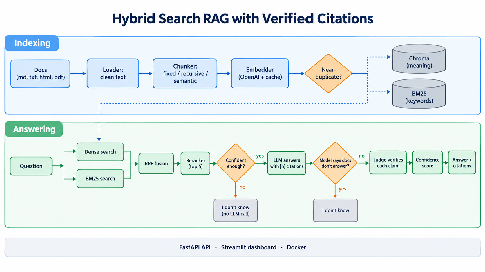
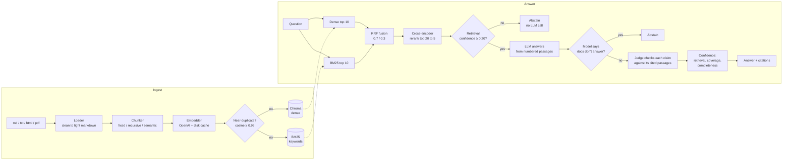

# Hybrid Search RAG with Verified Citations

Ask questions about a documentation set and get answers built **only** from that documentation, with `[n]` citations that a judge model has checked, a confidence breakdown, and a structured "I don't know" when the docs don't cover the question.

The default corpus is the [FastAPI documentation](https://fastapi.tiangolo.com/) (122 pages, MIT licensed). The corpus path is configuration, so any folder of Markdown, text, HTML or PDF files works.

## Results

50 hand-written questions (25 lookup, 10 multi-hop, 8 unanswerable, 7 ambiguous), `gpt-4.1-mini-2025-04-14` for generation and judging, recursive chunks with hybrid retrieval:

| Metric | Baseline | Final |
|---|---|---|
| Answer correctness | 0.85 | **0.92** |
| Faithfulness (claims grounded in retrieved text) | 0.93 | **0.98** |
| Citation accuracy (citations the judge verified) | 0.88 | **0.96** |
| Unanswerable questions correctly refused | 0.62 | **1.00** |
| Answerable questions wrongly refused | 0 | **0** |
| Retrieval recall@5 / MRR | 0.81 / 0.80 | 0.81 / 0.80 |

- **Chunking:** header-aware *recursive* chunks rank the right section first far more often than fixed windows (MRR 0.80 vs 0.58). Semantic chunks trail on correctness (0.87 vs 0.92) because they lose section headings. See [docs/CHUNKING.md](docs/CHUNKING.md).
- **Hybrid vs dense-only:** similar correctness (0.90 vs 0.89, within run-to-run noise), but hybrid ranks the right section higher (MRR 0.80 vs 0.71) and catches exact identifiers that embeddings miss.
- Full tables, per question type and caveats: [reports/eval/RESULTS.md](reports/eval/RESULTS.md). How we got from baseline to final: [docs/CASE_STUDY.md](docs/CASE_STUDY.md).

## How it works



The detailed, editable version of the same flow:



- **Hybrid retrieval.** Dense search finds passages by meaning; BM25 finds exact tokens such as `OAuth2PasswordBearer`. Reciprocal Rank Fusion merges the two ranked lists by rank, since their scores are not comparable, and a local cross-encoder rescores the top 20.
- **Grounded answers.** The model sees numbered passages and must cite them. A judge then checks each claim against *all* the passages it cites. A citation to a passage the judge did not need is flagged.
- **Two abstain layers.** Weak retrieval stops before any LLM call. If retrieval looked fine but the model says the documents don't answer, that also becomes a structured abstention with `found`, `missing` and `suggested_docs`.
- **Both indexes stay in sync.** The indexer writes Chroma then BM25 and rolls back Chroma if BM25 fails. `/healthz` reports if they ever diverge.

## Quickstart

Requires [uv](https://docs.astral.sh/uv/) and an OpenAI API key.

```bash
uv sync                                   # installs Python 3.12 and dependencies
cp .env.example .env                      # then set OPENAI_API_KEY and LLM_MODEL
uv run python scripts/seed.py             # index the corpus (all 3 chunking strategies, a few cents)
uv run uvicorn rag.api.main:app           # API on http://localhost:8000 (docs at /docs)
uv run streamlit run src/rag/dashboard/app.py   # dashboard on http://localhost:8501
uv run python scripts/demo.py             # five questions, one per behaviour
```

`LLM_MODEL` is read from the environment and never hardcoded. The evaluation used `gpt-4.1-mini-2025-04-14`.

**Docker** (`docker compose up --build`) runs seed, then the API, then the dashboard, with a shared data volume. The Dockerfile uses CPU-only torch and bakes in the reranker model. *It has not been built on this project's development machine yet.*

## API

| Method | Path | What it does |
|---|---|---|
| `POST` | `/v1/ask` | `{"question", "mode": "hybrid" or "dense", "top_k"}` returns the answer, citations, confidence and retrieved chunks |
| `POST` | `/v1/ingest` | Upload a `.md`, `.txt`, `.html` or `.pdf` file. Returns 201, or 413, 415 or 422 with a clear message |
| `GET` | `/v1/documents` | Indexed documents with chunk counts |
| `GET` | `/healthz` | Status, chunk count, whether both indexes hold the same chunks |

## Tests and evaluation

```bash
uv run pytest -m unit            # 381 tests, no network, fakes only
uv run pytest -m integration     # 12 tests, real Chroma + BM25 + cross-encoder offline, no network
uv run pytest -m live            # 3 tests against the real OpenAI API (plain `pytest` skips these)

uv run python scripts/run_eval.py --what chunking    # fixed vs recursive vs semantic
uv run python scripts/run_eval.py --what retrieval   # hybrid vs dense-only
uv run python scripts/compare_runs.py reports/eval/baseline reports/eval/final
```

Judge calls are cached on disk, so re-running an evaluation only pays for generation. `--resume` reuses variants that already finished without errors.

## Project layout

```
src/rag/
  core/         shared models, interfaces, config, fakes (changes logged in CONTRACT_REQUESTS.md)
  ingestion/    loaders (md, txt, html, pdf) and the three chunkers
  indexing/     OpenAI embedder + cache, Chroma store, BM25 index, syncing indexer
  retrieval/    dense, sparse, RRF fusion, cross-encoder reranker, retriever
  generation/   prompts, generator, citation verifier, confidence, abstention
  evaluation/   golden set (golden/qa.jsonl), metrics, judge cache, runner, threshold sweep
  api/          FastAPI app, routes, service.py (the only module that wires everything)
  dashboard/    Streamlit UI over the API
scripts/        seed, run_eval, sweep_threshold, compare_runs, demo, list_sections
tests/          unit/, integration/, live/, fixtures/ (a 5-doc fictional corpus)
reports/eval/   baseline, calibration and final runs as JSON + Markdown
```

`DESIGN.md` is the original build plan; `CONTRACT_REQUESTS.md` records every change to `core/` and why.
